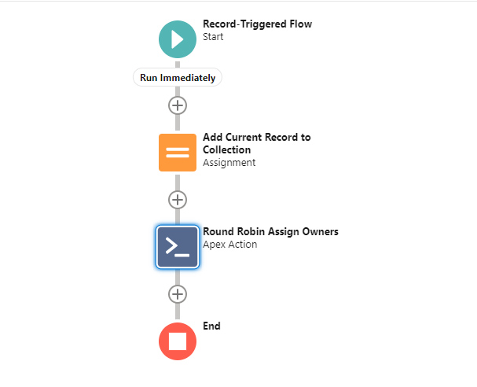
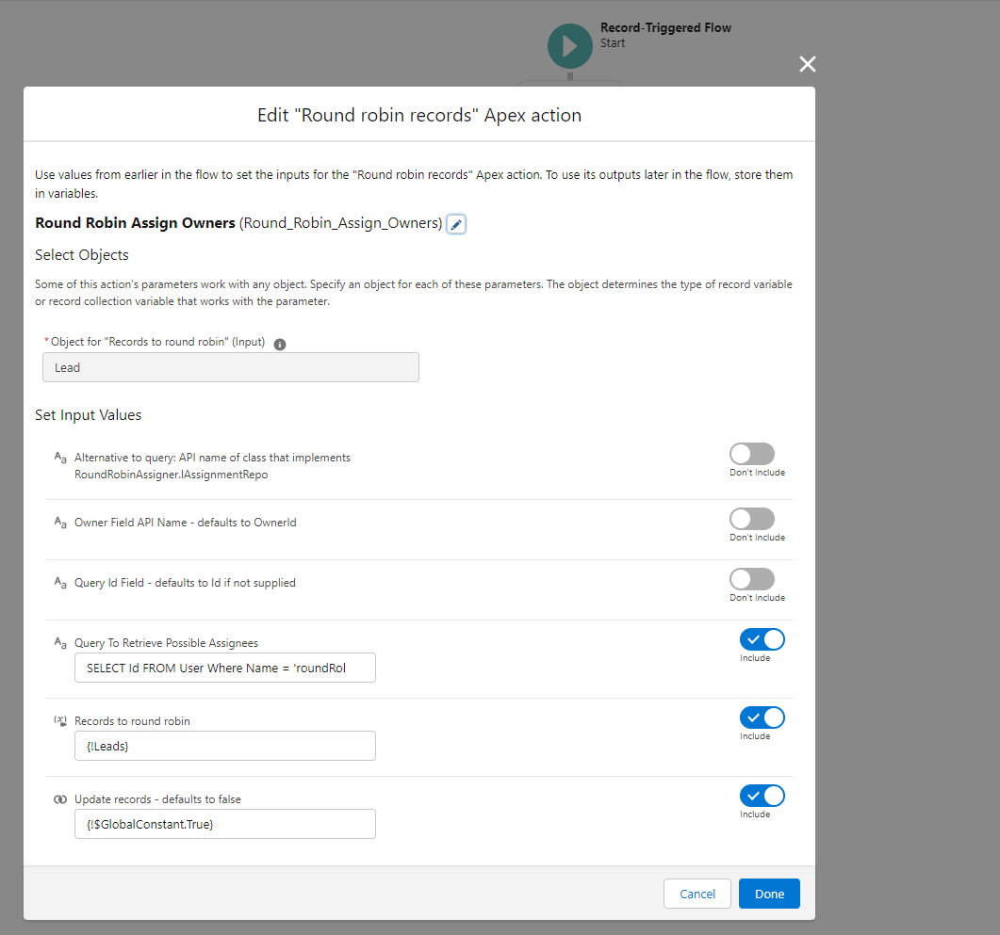

# Salesforce Round Robin Assigner

[](https://github.com/jamessimone/salesforce-round-robin/actions/workflows/deploy.yml 'Click to view deployment pipeline history')
[](https://github.com/jamessimone/salesforce-round-robin/blob/main/package.json)

Between Assignment Rules and OmniChannel, there are plenty of out-of-the-box options for how records get owners assigned to them in Salesforce. As always, there are also many things that require customization. As it has frequently been the case that a "round robin" assignment be part of companies' business rules, Salesforce Round Robin aims to easily add support for round robin-type assignments to both Flow and Apex.

Here are some of the benefits to using this package:

- Ease of setup. All you have to supply (via Flow or Apex) is which records qualify to be part of the round robin (e.g. which records are part of the "ownership pool") and the records you'd like to have owners assigned
- Speed and transactional safety - there are many pitfalls with naive round robin implementations, but the biggest one is unfair assignment (where some owners receive more records than others). This skew is typically caused by the tracking for how owners have been assigned getting out of date with how many records each person has already received. This package takes advantage of Salesforce's Platform Cache to offer truly fair assignment.

## Round Robin Assignment From Flow

Something to be aware of when using Flow as the starting point - until Apex Invocable actions are supported from the "before create/update" part of Flow, one should be aware of the possibility for recursion when making use of the bundled invocable action with Record-Triggered Flows. Put simply - because this action can only be run _after_ create/update presently, any _other_ parts of your Flow(s) may run twice.

Here's a basic look at what a simple Record Triggered Flow would look like using the action:



And then the configuration for the action:



### Invocable Properties To Set

- `Object for "Records to round robin" (Input)` - for Record-Triggered Flows, this should correspond to the object the flow is for. For anything else, this should correspond to the SObject name of the record collection you're looking to pass in
- `Alternative to query: API name of class that implements RoundRobinAssigner.IAssignmentRepo` (optional) - for Flow developers working with Apex (or with Apex developers), you may have more complicated business rules for which Users or other records qualify to be used in the assignment than the Query property can provide you with. For advanced users only!
- `Owner Field API Name - defaults to OwnerId` (optional) - which field are you looking to assign to? Not all objects have `OwnerId` as a field (the detail side of M/D relationships, for instance). Use the field's API Name for these cases.
- `Query Id Field - defaults to Id if not supplied` (optional) - used in conjunction with the `Query To Retrieve Possible Assignees` property, below. If you are using the round robin assigner to assign lookup fields _other_ than `OwnerId`, this allows you to override which field is pulled off of the records that the `Query To Retrieve Possible Assignees` returns.
- `Records To Round Robin` (optional, but should always be supplied) - set this equal to a collection variable that is either the output of a `Get Records` call, contains `$Record` in a Record-Triggered flow, etc ...
- `Update records - defaults to false` (optional) - by default, the collection supplied via the `Records To Round Robin` property aren't updated; set this to `{!$GlobalConstant.True}` to have the action update your records with their newly assigned owners

## Round Robin Assignment From Apex

You have quite a few options when it comes to performing round robin assignments from Apex. I would _highly recommend_ performing round robin assignments in the `BEFORE_UPDATE` Apex trigger context so that owners are assigned prior to being committed to the database.

Here are a few ways that you can perform assignments:

- You can re-use the static method `FlowRoundRobinAssigner.assign` by creating synthetic `FlowRoundRobinAssigner.FlowInput` records
- You can call use the bundled `QueryAssigner`:

  ```java
    // in a Trigger/ trigger handler class
    RoundRobinAssigner.IAssignmentRepo queryRepo = new QueryAssigner('SELECT Id FROM User WHERE Some_Condition__c = true', 'Id');
    RoundRobinAssigner.Details assignmentDetails = new RoundRobinAssigner.Details();
    assignmentDetails.assignmentType = 'this is the cache key';
    new RoundRobinAssigner(queryRepo, assignmentDetails).assignOwners(someListOfSObjectsToBeAssigned);
  ```

- Or you can supply an implementation of `RoundRobinAssigner.IAssignmentRepo` that retrieves the records that qualify for the ownership pool via the `getAssignmentIds` method:

```java
// inside RoundRobinAssigner:
public interface IAssignmentRepo {
  // note that the provided implementations of IAssignmentRepo
  // don't make use of the "assignmentType" argument passed here,
  // but this helps to decouple your logic for returning assignment Ids
  // in the event that you want to provide a single implementation that
  // can respond to multiple assignment types!
  List<Id> getAssignmentIds(String assignmentType);
}
```

The `assignmentType` property that comes from the invocable action (`FlowRoundRobinAssigner`) is always the `Object Type.Field Name`; so something like `Lead.OwnerId` for a typical Lead round robin.

Note that the records are _not_ updated by default in `RoundRobinAssigner`; if you are updating a related list of records (where updating them in a `BEFORE_UPDATED` context wouldn't just persist the updated ownership values by default), you should call `update` or `Database.update` on the records after calling the assigner.

## Additional Details & Architectural Notes

Again, this package employs the usage of Platform Cache to ensure fairness across competing transactions. This means that Platform Cache must be _enabled_ in your org in order to successfully install the round robin package. By default, it creates a 1 MB partition within your org cache. That should be plenty for most use-cases; if you have a ton of _different_ round robin assignments you may need to bump that amount up in:

- Setup -> Platform Cache -> Click "Edit" on the `RoundRobinCache` record -> Bump the amount to 2 under the `Provider Free` section
